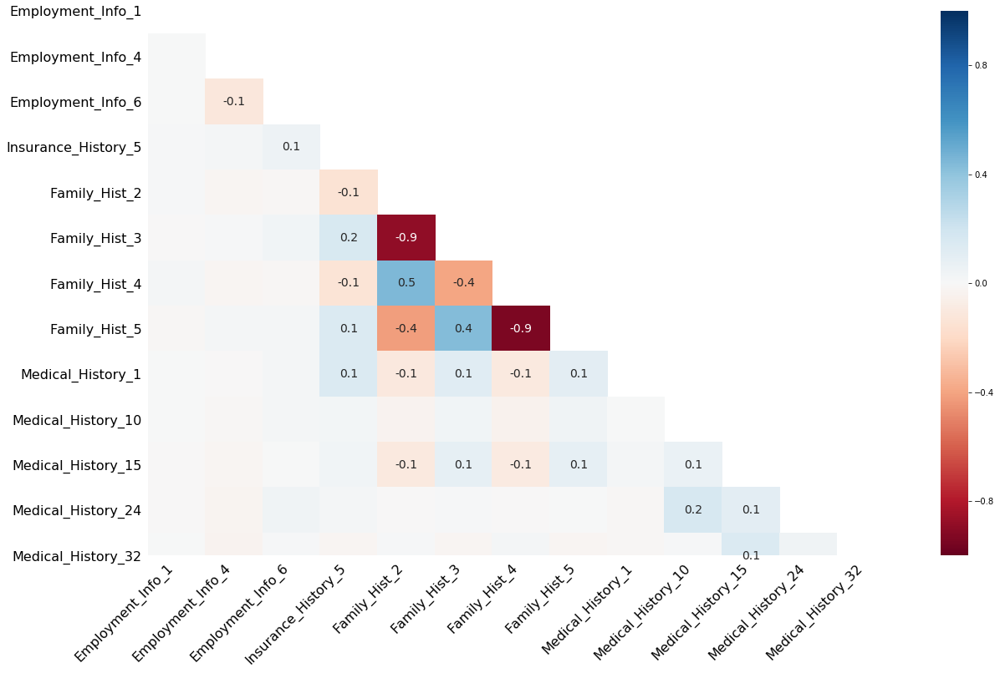

# Nicolas Perez

## About
My name is Nicolas and I'm an Applied Mathematics and Computer Science student at USC. I'm passionate about data and look forward to working on analytical solutions to real world problems. Here is a little of what I've done:

## Data Science for Consulting
- Missing data in life insurance application dataset
- We analyzed what features we could exclude and found ways to impute values for missing data.
- Dataset contains 128 columns and a discrete response for level of risk (1-8).

### Analysis
- We study the correlation of each feature to the response. The correlation matrix of columns against response provides a way to understand what features have the most significance for a predictive algorithm:
- 

